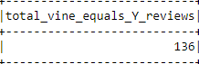
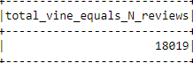
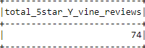
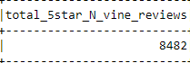
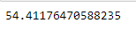
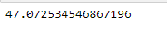

# Big_Data_AWS

## **Overview**
The purpose of the project is to perform ETL on the furniture dataset and analysis the reviews to determine if there is any bias towards favorable reviews from Vine members in the dataset. I used Pyspark to perform ETL process to extract the dataset, transform the data, connect to an AWS RDS instance, and load the transformed data into pgAdmin. 

## **Results**

* How many Vine reviews and non-Vine reviews were there?

Total vine and non-vine reviews respectively

* How many Vine reviews were 5 stars? How many non-Vine reviews were 5 stars?

Total 5-Star vine and non-vine reviews respectively

* What percentage of Vine reviews were 5 stars? What percentage of non-Vine reviews were 5 stars?

Total percent 5-Star vine and non-vine reviews respectively

## **Summary**
From the above figures, we can see that there is not much difference in the results for vine and non vine reviews. For the additional analysis, I found that even the percentage of helpful_votes/total_votes thats is more than 50% is quite similar in both vine and no-vine reviews which again indicates no sign of bias. There doesn't seem to be any bias for vine reviews.
For the additonal analysis, even when we compare the percentage of helpful_votes/total_votes that are greater than 50%, the values are pretty close for both vine and non-vine reviews indicating no sign of bias for vine reviews.
